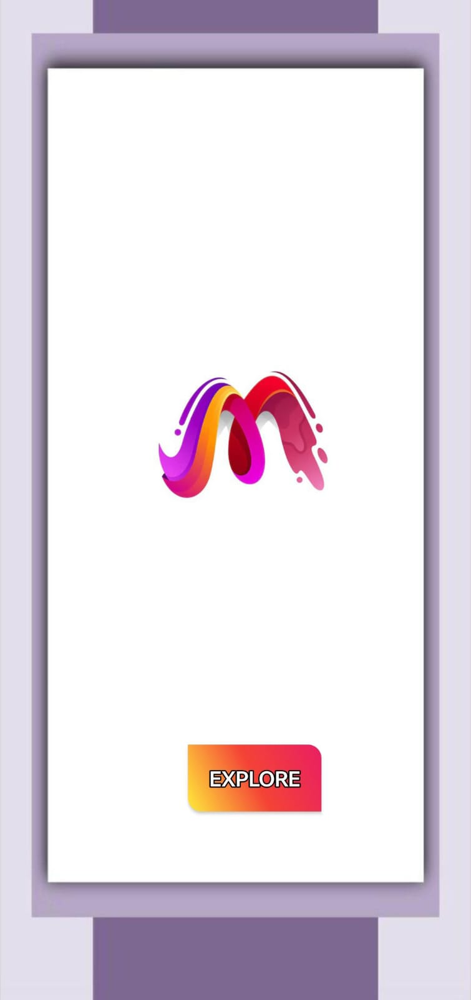
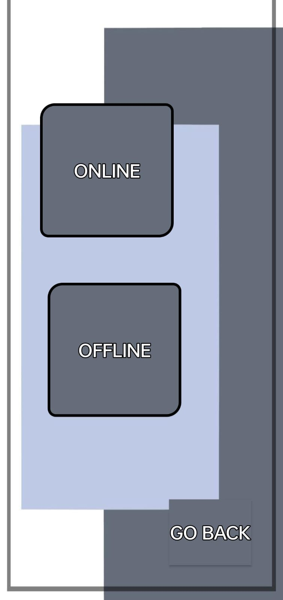

# MegaSuit App

📱 **Overview**

MegaSuit is a versatile Android application developed using Java that brings together multiple utilities and features into one app. 
Designed to provide convenience and efficiency, the app offers a variety of tools such as a browser, calculator, media player, quiz page, and more, all accessible through an intuitive and user-friendly interface.

---

✨ **Features**
1. *Welcome Page*
   - A staring page from user can 'Explore'.
     
2. *Login/Signup Page*
   - Users can create accounts using two methods:
       1. **Online**: Stores user data securely in Firebase.
       2. **Offline**: Saves user data locally on the device.
   - After signing up, users log in using the same methods to access the main features.

3. *Index Page (Home Page)*
   - Acts as the central hub of the app.
   - Includes buttons for accessing various tools and features:
     1. **Browser**: Enter any link to browse web pages.
     2. **Calculator**: Perform basic arithmetic operations (addition, subtraction, multiplication, division).
     3. **Contact And Message**: Make a call or send a message to a specific number.
     4. **Media Player**: Play one of five pre-loaded songs.
     5. **Quick Settings**: Toggle Wi-Fi, Bluetooth, and Torch on/off with a single button.
     6. **Quiz**: Answer questions displayed on the page and at the end your score will be shown.
     7. **Text Displayer**: Display content entered by the user.
   - **Logout Button**: Returns users to the Welcome Page.
4. *Additional Features*
   - **Vibrator**: Vibrates on errors, such as entering incorrect login credentials, providing immediate feedback.
   - **Text-to-Speech**: Reads out messages when buttons are clicked to improve accessibility.

---

📎**Technologies Used**
- ***Languages***: Java
- ***Framework***: Android SDK
- ***IDE***: Android Studio
- ***Database***: Firebase (for online login/signup data storage).

---

📜**Permissions Used**
To ensure the app functions correctly, the following permissions are included:
   - ***SEND_SMS***: To send messages via the Contact and Message feature.
   - ***CALL_PHONE***: To make phone calls from the app.
   - ***BLUETOOTH_CONNECT, BLUETOOTH, BLUETOOTH_ADMIN***: For managing Bluetooth in Quick Settings.
   - ***ACCESS_WIFI_STATE, CHANGE_WIFI_STATE***: For managing Wi-Fi in Quick Settings.
   - ***INTERNET***: To enable online features like Firebase and the browser.
   - ***RECEIVE_SMS, READ_SMS***: For SMS functionalities.

---

🛠️**Installation**
1. Clone this repository to your local machine:
   `git clone https://github.com/Snehaagraw/MegaSuit`
2. Open the project in **Android Studio.**
3. Sync Gradle files to install dependencies.
4. Run the app on an emulator or a physical Android device.

---

🎨**Screenshots**
1. *Welcome Page*
   

2. *Login/Signup Page*

    
   
   
4. *Index Page*

   

---

🚀**Future Enhancements**
   - Add more tools and features to expand the app’s functionality.
   - Improve the user interface for a more seamless experience.
   - Integrate voice commands and AI-based features for better usability.

---
